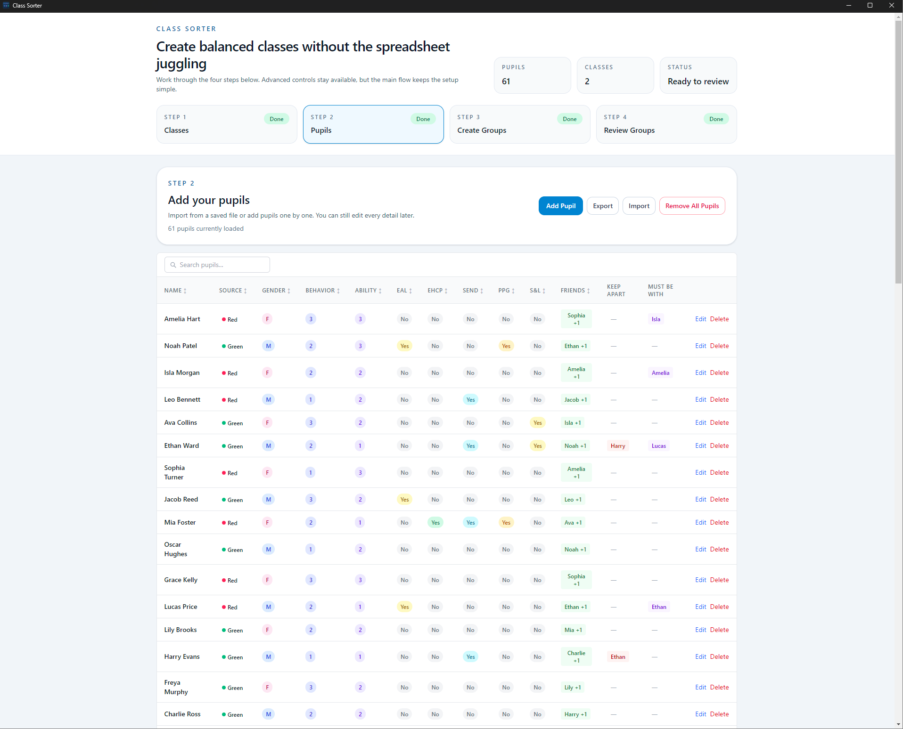
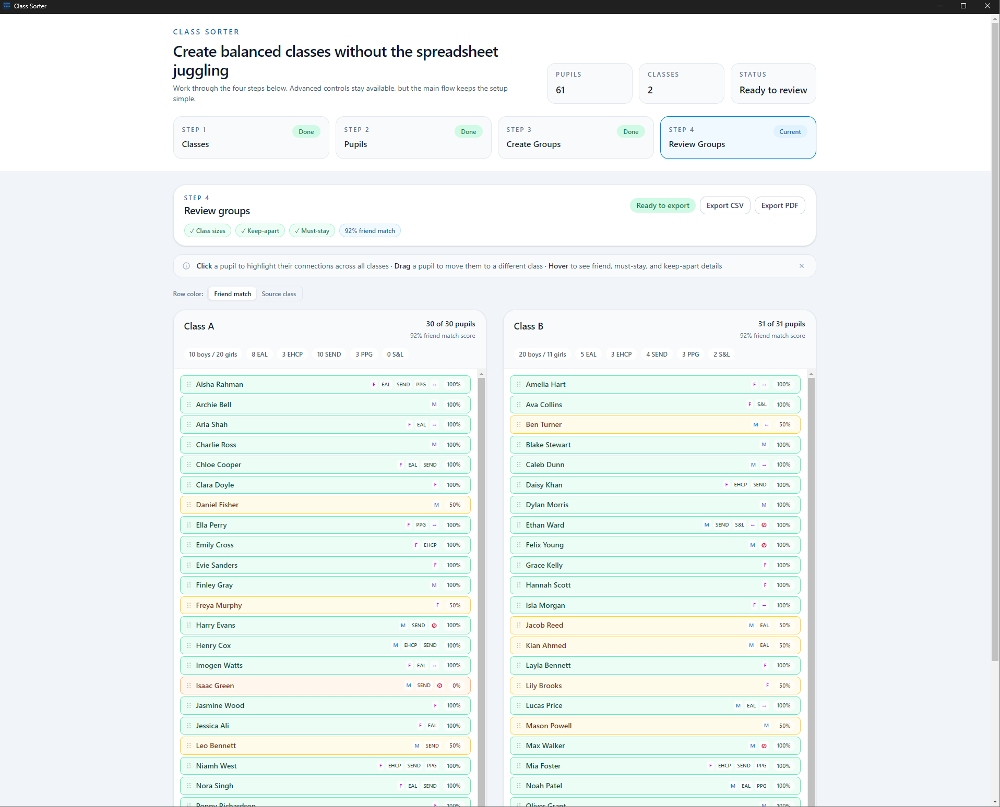

# Class Sorter

A desktop app for teachers to sort students into balanced classes — handling preferred friends, blacklisted pairs, gender balance, EAL distribution, and SEND/EHCP/PPG needs automatically.

## Download

Download the latest installer from the [Releases page](https://github.com/chrisella/class-sorter/releases/latest):

| Platform | File |
|----------|------|
| Windows (installer) | `Class-Sorter-Setup-x.x.x.exe` |
| Windows (portable) | `Class-Sorter-x.x.x.exe` |
| Linux | `.AppImage` |

Run the installer and launch **Class Sorter** from your desktop or Start menu.

## How it works

The app walks you through four steps:

**Step 1 — Classes:** Define the classes you want to create, their target sizes, and teacher names.

**Step 2 — Pupils:** Add your students and their properties — gender, EAL status, behaviour and ability rankings, EHCP/SEND/PPG flags, preferred friends, and any students they must not be placed with.

You can import a CSV file to populate the list quickly. Export is also supported for backups or transferring data between machines.

**Step 3 — Sort:** Run the sorting algorithm. It respects hard constraints (blacklisted pairs are never placed together; must-be-with pairs are always kept together) and optimises soft constraints (friend placement, gender/EAL/behaviour/ability balance) using simulated annealing.

**Step 4 — Results:** View the resulting classes and manually move students between classes if needed. Export to PDF or Excel for sharing.

## Screenshots

> **Note: all data shown in these screenshots is entirely fake test data. No real students are depicted.**

## Updates

Class Sorter checks for updates automatically on launch. When a new version is available you will be prompted to install it.
